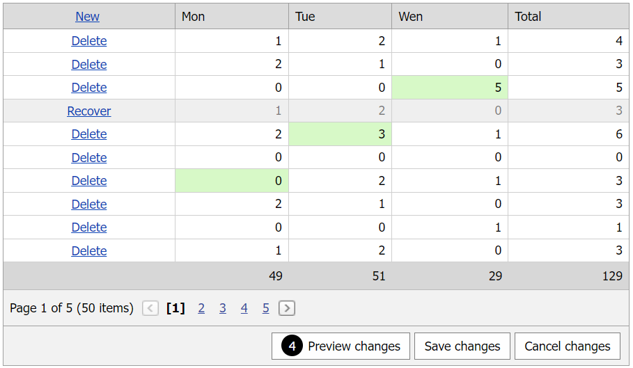

# Grid View for ASP.NET Web Forms - How to calculate values and update total summaries dynamically in batch edit mode
<!-- run online -->
**[[Run Online]](https://codecentral.devexpress.com/t116925/)**
<!-- run online end -->

This example demonstrates how to create an unbound column that changes its values based on other column values and replace summary items with custom footer templates to calculate total summaries dynamically in batch edit mode. This example combines the following approaches:
* [How to calculate values dynamically in batch edit mode](https://github.com/DevExpress-Examples/asp-net-web-forms-gridview-calculate-values-dynamically-batch-mode)
* [How to update total summaries on the client in batch edit mode](https://github.com/DevExpress-Examples/asp-net-web-forms-grid-update-total-summaries-on-client-in-batch-mode)



## Overview

Follow the steps below to calculate column values and update total summaries on the client in batch edti mode:

1. Add total summary items for the corresponding columns. Use the item's [Tag](https://docs.devexpress.com/AspNet/DevExpress.Web.ASPxSummaryItemBase.Tag) property to identify the summary item and get its value.

    ```aspx
    <TotalSummary>
        <dx:ASPxSummaryItem SummaryType="Sum" FieldName="Mon" Tag="Mon_Sum" />
        <dx:ASPxSummaryItem SummaryType="Sum" FieldName="Tue" Tag="Tue_Sum" />
        <dx:ASPxSummaryItem SummaryType="Sum" FieldName="Wen" Tag="Wen_Sum" />
        <dx:ASPxSummaryItem SummaryType="Sum" FieldName="Total" Tag="Total_Sum" />
    </TotalSummary>
    ```

    ```cs
    protected object GetSummaryValue(string fieldName) {
        ASPxSummaryItem summaryItem = Grid.TotalSummary.First(i => i.Tag == fieldName + "_Sum");
        return Grid.GetTotalSummaryValue(summaryItem);
    }
    ```

2. Set the unbound column's [ShowEditorInBatchEditMode](https://docs.devexpress.com/AspNet/DevExpress.Web.GridDataColumnSettings.ShowEditorInBatchEditMode) property to `false` to make the column read-only in batch edit mode. Replace all summary items with custom [footer templates](https://docs.devexpress.com/AspNet/DevExpress.Web.GridViewColumn.FooterTemplate).

    ```aspx
    <dx:GridViewDataTextColumn FieldName="Total" UnboundType="Decimal" ReadOnly="true">
        <Settings ShowEditorInBatchEditMode="false" />
        <FooterTemplate>
            <dx:ASPxLabel ID="ASPxLabel1" runat="server" ClientInstanceName="labelTotal"
                Text='<%# GetSummaryValue((Container.Column as GridViewDataColumn).FieldName) %>' />
        </FooterTemplate>
    </dx:GridViewDataTextColumn>
    ```

3. Handle the grid's client-side [BatchEditEndEditing](https://docs.devexpress.com/AspNet/js-ASPxClientGridView.BatchEditEndEditing), [BatchEditRowDeleting](https://docs.devexpress.com/AspNet/js-ASPxClientGridView.BatchEditRowDeleting), and [BatchEditRowRecovering](https://docs.devexpress.com/AspNet/js-ASPxClientGridView.BatchEditRowRecovering) events to recalculate unbound column values and total summaries. Call the grid's [batchEditApi.GetCellValue](https://docs.devexpress.com/AspNet/js-ASPxClientGridViewBatchEditApi.GetCellValue(visibleIndex-columnFieldNameOrId)) method to get initial cell values and the [batchEditApi.SetCellValue](https://docs.devexpress.com/AspNet/js-ASPxClientGridViewBatchEditApi.SetCellValue(visibleIndex-columnFieldNameOrId-value)) method to assign new values to the unbound column.

## Files to Review

* [Default.aspx](./CS/Default.aspx) (VB: [Default.aspx.vb](./VB/Default.aspx.vb))
* [Default.aspx.cs](./CS/Default.aspx.cs) (VB: [Default.aspx.vb](./VB/Default.aspx.vb))

## Documentation

* [Grid in Batch Edit Mode](https://docs.devexpress.com/AspNet/16443/components/grid-view/concepts/edit-data/batch-edit-mode)
* [Grid View Templates](https://docs.devexpress.com/AspNet/3718/components/grid-view/concepts/templates)

## More Examples

* [Grid View for ASP.NET MVC - How to calculate values and update total summaries dynamically in batch edit mode](https://github.com/DevExpress-Examples/gridview-batch-edit-how-to-calculate-unbound-column-and-total-summary-values-on-the-fly-t124151)
